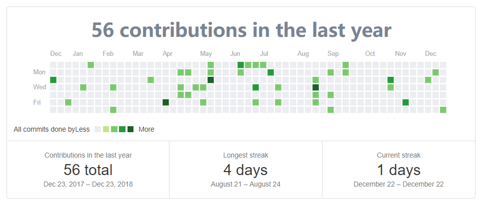

# React Github Calender

In commonJS environment, you can install `@xwl7001/react-github-calender` using below commands

```sh
# Using npm
npm i @xwl7001/react-github-calender

# Using yarn
yarn add @xwl7001/react-github-calender
```

Inspired from [@ajay2507](https://github.com/ajay2507/react-github-calender) to create `@xwl7001/react-github-calender`



## Documentation
### `ReactGithubCalender`
Include the Github Calender into your React App.

#### Props

- **String** `username`: Github Username.
- **String** `text`: Description to be included.
- **Function** `proxy`: proxy function to fetch github page

## Issues
you are welcome to open the issues [here](https://github.com/xwl7001/react-github-calendar/issues)

## How to contribute
please let me know if you have any ideas!!. Create an issue we will solve together.